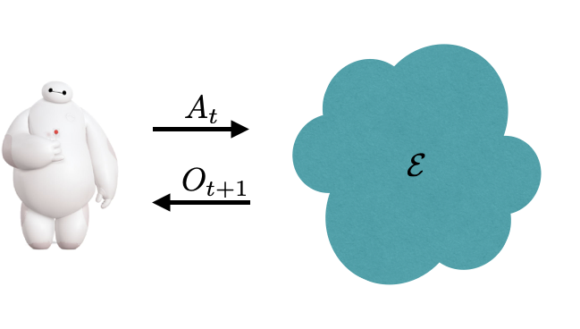

# Reiforcement Learning: Behaviors and Applications.

This library contains the companion code to the "Reinforcement Learning: Behaviors and Applications" course at Stanford University. It include a clean RL formulation and interface implementation and some example agents and environments.

## Getting started

The easiest way to get started is by working with examples found in the
[examples] subdirectory. A simple entry point is our [tutorial
notebook][Tutorial]

[examples]: examples/
[tutorial]: https://github.com/mibrahimi/rlba/blob/main/examples/tutorial.ipynb

## Installation

The library is tested on Python 3.7, 3.8 and 3.9.

1.  While you can install RLBA in your standard python environment, we
    *strongly* recommend using a
    [Python virtual environment](https://docs.python.org/3/tutorial/venv.html)
    to manage your dependencies.

    ```bash
    python3 -m venv rlba
    source rlba/bin/activate
    pip install --upgrade pip setuptools wheel
    ```

1.  Clone the RLBA GitHub repository

    ```bash
    git clone ssh://github.com/mibrahimi/rlba
    ```

2.  Execute the following command from the main directory
    (where `setup.py` is located):

    ```bash
    pip install .[jax,testing]
    ```

## References

The library uses some of the code, tools, and utilitites from [acme].

[acme]: https://github.com/deepmind/acme
